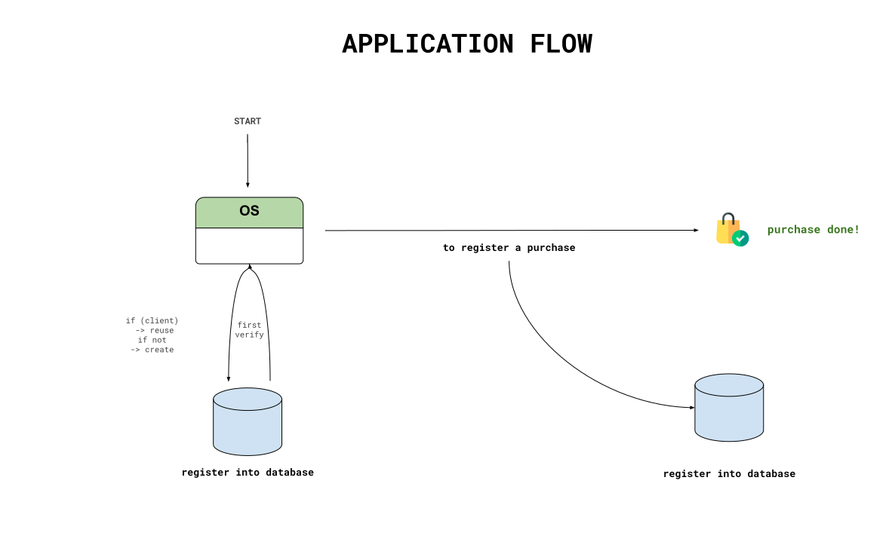
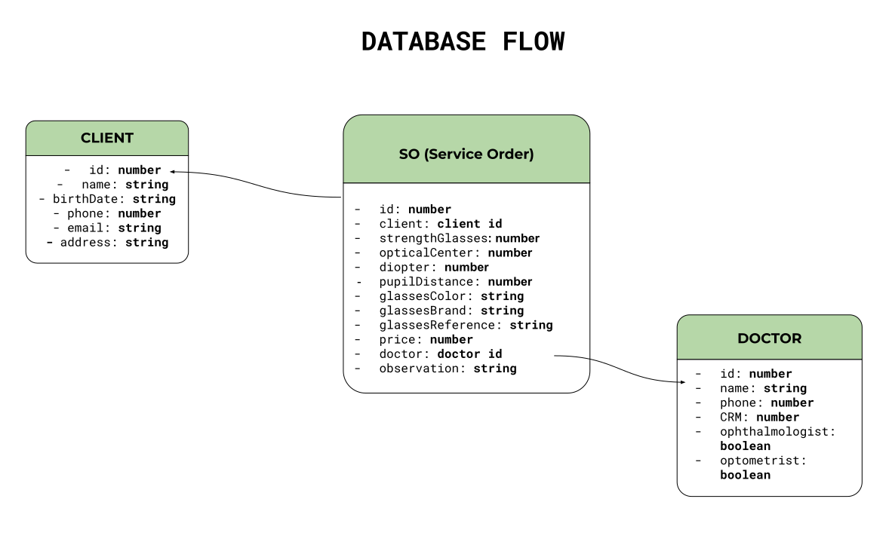

# SalesManagement

## Rules
> Doctor
- [ ] Add a Doctor into your database after assigning him/her to a `SO (Service Order)`

> Client
- [ ] Add a Client into your database after assigning him/her to a `SO (Service Order)`

> Service Order
- [ ] To add your `SO (Service Order)` you need to fill all fields. Two special fields are other tables `Doctor` and `Client`.

> Cash Register
- [ ] Add a new movement that would be assigned to an OS or not. If not, you can explain what was done.

> Other observations:

- [ ] To register or get the list of a `Doctor`, `Client` or `SO` you need to be logged in the system.

### Application flow:

### Database flow:

